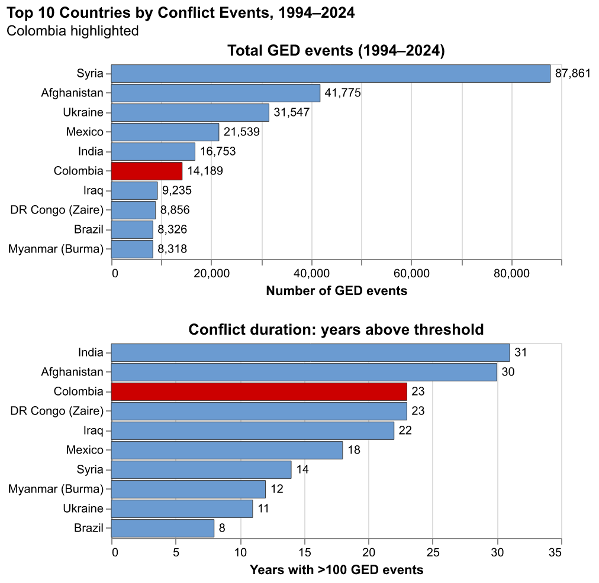

**Group 8:** Alejandra Patiño, Sofía Linares, Juan Camisassa  
**Lecture section:** Monday 9:00–10:20 (Sofia) and 10:30–11:50 (Alejandra and Juan)  
**GitHub usernames:** juancamisassa, sofialinaresb, alejandrapatino

```{python}
#| label: setup
#| echo: false

import os
os.environ["MPLCONFIGDIR"] = "/tmp/mpl_config"
os.makedirs("/tmp/mpl_config", exist_ok=True)

import matplotlib
matplotlib.use("Agg")

import pandas as pd
import geopandas as gpd
import matplotlib.pyplot as plt
import matplotlib.colors as mcolors
from matplotlib.patches import Patch
from matplotlib.lines import Line2D
import numpy as np
import altair as alt
import unicodedata
import re
```

## 1. Introduction and Context

Colombia experienced an armed conflict that lasted several decades, leaving long-lasting territorial consequences. One of these consequences is the widespread presence of antipersonnel landmines in many areas. Because the conflict persisted over time and across regions, landmine contamination remains an important challenge for post-conflict recovery and territorial development. By 2018, it was estimated to be among the top 10 countries worldwide with the highest number of victims of antipersonnel mines and explosive remnants of war (Landmine Monitor, 2016, 2018; Castiblanco et al., 2020).

This project examines the spatial overlap between armed conflict and landmine incidents at the municipal level and evaluates whether demining policy has targeted the most affected areas. Our goal is to build a data-driven prioritization tool for demining policy allocation efforts.

```{python}
#| label: graph-presentacion
#| echo: false

df_ged = pd.read_excel("data/raw-data/GEDEvent_v25_1.xlsx", sheet_name=0)
df_ged = df_ged[(df_ged["year"] >= 1994) & (df_ged["year"] <= 2024)]

totals = df_ged.groupby("country").size().sort_values(ascending=False)
top10_ged = totals.head(10)

THRESHOLD = 100
events_by_year = df_ged.groupby(["country", "year"]).size().reset_index(name="n")
years_above = events_by_year[events_by_year["n"] > THRESHOLD]
duration = years_above.groupby("country").size()
duration_top10 = duration.reindex(top10_ged.index, fill_value=0)

top10_df = pd.DataFrame({
    "Country": top10_ged.index,
    "Events": top10_ged.values,
    "is_colombia": [c == "Colombia" for c in top10_ged.index],
})

duration_df = pd.DataFrame({
    "Country": duration_top10.index,
    "Years": duration_top10.values.astype(int),
    "is_colombia": [c == "Colombia" for c in duration_top10.index],
})

top_bars = alt.Chart(top10_df).mark_bar(stroke="#333333", strokeWidth=0.5).encode(
    y=alt.Y("Country:N",
            sort=alt.EncodingSortField(field="Events", order="descending"),
            title=""),
    x=alt.X("Events:Q", title="Number of GED events"),
    color=alt.condition(alt.datum.is_colombia,
                        alt.value("#cc0000"), alt.value("#6b9bd1")),
    tooltip=[alt.Tooltip("Country:N"), alt.Tooltip("Events:Q", format=",")],
)
top_text = alt.Chart(top10_df).mark_text(align="left", dx=4, fontSize=10).encode(
    y=alt.Y("Country:N", sort=alt.EncodingSortField(field="Events", order="descending")),
    x="Events:Q",
    text=alt.Text("Events:Q", format=","),
)
top_panel9 = (top_bars + top_text).properties(
    width=380, height=165,
    title="Total GED events (1994–2024)",
)

bot_bars = alt.Chart(duration_df).mark_bar(stroke="#333333", strokeWidth=0.5).encode(
    y=alt.Y("Country:N",
            sort=alt.EncodingSortField(field="Years", order="descending"),
            title=""),
    x=alt.X("Years:Q", title="Years with >100 GED events",
            scale=alt.Scale(domain=[0, 32])),
    color=alt.condition(alt.datum.is_colombia,
                        alt.value("#cc0000"), alt.value("#6b9bd1")),
    tooltip=[alt.Tooltip("Country:N"), alt.Tooltip("Years:Q")],
)
bot_text = alt.Chart(duration_df).mark_text(align="left", dx=4, fontSize=10).encode(
    y=alt.Y("Country:N", sort=alt.EncodingSortField(field="Years", order="descending")),
    x="Years:Q",
    text=alt.Text("Years:Q", format="d"),
)
bot_panel9 = (bot_bars + bot_text).properties(
    width=380, height=165,
    title="Conflict duration: years above threshold",
)

chart9 = alt.vconcat(top_panel9, bot_panel9).properties(
    title=alt.Title(
        "Top 10 Countries by Conflict Events, 1994–2024",
        subtitle="Colombia highlighted"),
)

chart9.save("presentation_top10_ged.png", scale_factor=2)
```

{width=85%}

## 2. Research Questions & Data

We focus on two questions:

1. Are conflict events and landmine incidents spatially correlated at the municipal level?
2. Has the demining policy targeted the most affected municipalities?

Our objective is descriptive rather than causal. Instead of estimating causal effects, we aim to develop a practical prioritization framework that policymakers can use to identify municipalities that may require additional demining effort.

To address these questions, we combine four datasets:

- **UCDP Georeferenced Event Dataset (GED):** Geo-coded events of organized violence involving at least one fatality and a state or armed group actor. We subset the database to consider only events in Colombia from 1994 onward.
- **Descontamina Colombia (AICMA):** Database of demining operations and antipersonnel mine incidents (MAP). We use it for both demining activity and mine incidents.
- **National Center for Historical Memory (CNMH):** Public database of landmine and explosive device victims from 1953 onward. We filter for mine-related events and aggregate victims by municipality.
- **GADM v4.1 (Colombia, Level 2):** Administrative boundaries for Colombian municipalities, used as the geographic base for our spatial analysis.

To integrate these datasets, we merge them at the municipal level. Municipality names are standardized (lowercase, removal of accents and special characters) and matched to GADM polygons using a lookup dictionary. For known discrepancies (for example, Bogotá variants), we apply manual mappings. Each municipality polygon is then assigned counts of conflict events, mine incidents, mine victims, and demining operations.

## 3. Approach and Coding

**Data wrangling:** All processing is done in our preprocessing module. We aggregate GED, CNMH and AICMA datasets by municipality, join to GADM geometries, and compute counts for conflict events, mine incidents, mine victims, and demining operations. The .qmd contains this logic; preprocessing.py generates derived data for the Streamlit app.

**Priority index:** We define a priority index as Z(conflict) + Z(mine incidents) − Z(demining), where Z denotes standardization. This combines conflict intensity, mine incident intensity, and demining effort on a comparable scale. To improve interpretability, the map color scale uses the 2nd–98th percentiles of the index.

**Streamlit app:** Our dashboard has three pages: (1) Conflict & Mine Maps, with choropleth maps of conflict events, mine incidents, and mine victims by municipality; (2) Demining Timeline, with demining operations and mine incidents over time, with historical milestones marked; (3) Priority Analysis, with the priority index map and the top 10 municipalities. For deployment on Streamlit Community Cloud, we preprocess data locally (preprocessing.py) to avoid heavy geopandas dependencies at runtime.

## 4. Results – Streamlit Dashboard

The dashboard combines interactive maps with static visualizations to illustrate spatial patterns and policy responses. Access it at: [https://final-project-alesofjua-navguezjh2t5szddznayws.streamlit.app/](https://final-project-alesofjua-navguezjh2t5szddznayws.streamlit.app/)

**Conflict & Mine Maps (interactive):** Side-by-side choropleth maps allow users to explore conflict events alongside mine incidents or mine victims. The maps reveal a strong spatial overlap: municipalities with more conflict events tend to concentrate more mine incidents and victims, indicating a high correlation between the two phenomena.

**Demining Timeline:** A line chart shows the evolution of demining operations and mine incidents over time. Demining activity started to increase from the early 2000s, surging in 2010 and peaking around 2012, then declined before recovering in recent years. Mine incidents peaked earlier (around 2005–2006) and have since decreased. Vertical markers indicate key milestones (e.g., Start of Peace Negotiations 2012, Sign of the Peace Agreement 2016).

**Priority Analysis:** An interactive choropleth map displays the priority index spatially, and an interactive horizontal bar chart identifies the ten municipalities with the highest priority scores.

## 5. Demining Policy Context

Demining efforts in Colombia have evolved over several decades. Recorded demining operations increased from the early 2000s, reflecting both stronger policy prioritization and improved detection and reporting. The 2016 Peace Agreement formalized and institutionalized demining efforts, but the data show that substantial activity predates this milestone.

Academic literature suggests that demining can have significant economic and social benefits: it can facilitate access to infrastructure and markets (Chiovelli, Michalopoulos, & Papaioannou, 2018), enable productive use of natural resources (Gunawardana, Tantrigoda, & Kumara, 2016), and support land restitution in post-conflict areas (Cabrera & Pachón, 2017). Within this context, our prioritization framework aims to support a more efficient allocation of demining resources across municipalities.

## 6. Policy Implications and Limitations

We designed a priority index to help policymakers decide which municipalities to address:

$$Priority\ Index = (Z(conflict) + Z(mine\ incidents)) - Z(demining)$$

It provides a descriptive indicator of municipalities that may be under-served. High values suggest areas where demining activity may not yet match the intensity of conflict and mine incidents.

Several limitations should be acknowledged. First, the analysis is descriptive and does not establish causal relationships between conflict dynamics, landmine placement, and demining policy decisions. Second, the index does not account for differences in terrain, accessibility, or operational capacity across municipalities, which may influence the feasibility of demining operations.

## 7. Conclusion

By combining UCDP conflict data, AICMA (demining and mine incidents), CasosMI (victims), and GADM administrative boundaries, this project visualizes the spatial distribution of conflict and landmine contamination across Colombian municipalities. Our analysis documents the evolution of demining activity over time and proposes a priority index to identify municipalities where demining needs may remain greatest.

The resulting dashboard offers a practical tool that policymakers and researchers can use to explore spatial patterns of conflict, landmine contamination, and demining activity in Colombia.

```{=latex}
\newpage
```

## References

- Cabrera, L. A., & Pachón, W. (2017). Impacto socioeconómico del desminado humanitario: Análisis de los casos de restitución de tierras de las comunidades de San Francisco, Carlos (Antioquia, Colombia). *TraHs – Trayectorias Humanas Trascontinentales*.
- Castiblanco, D., Prada, M., Reyes, C., & Tocaría, D. (2020). Fíjate bien dónde pisas: Efectos del desminado humanitario en Colombia: ¿Menos coca y más desarrollo? Universidad de los Andes, Facultad de Economía, CEDE. https://hdl.handle.net/1992/41114
- Chiovelli, G., Michalopoulos, S., & Papaioannou, E. (2018). Landmines and spatial development (Working Paper No. 24758). National Bureau of Economic Research. https://doi.org/10.3386/w24758
- Gunawardana, H., Tantrigoda, D. A., & Kumara, U. A. (2016). Humanitarian demining and sustainable land management in post-conflict settings in Sri Lanka: Literature review. *Journal of Management and Sustainability*, 6(3), 79–88. https://doi.org/10.5539/jms.v6n3p79
- International Campaign to Ban Landmines. (2016). Landmine monitor 2016: 18th annual edition. https://the-monitor.org/reports/landmine-monitor-2016
- International Campaign to Ban Landmines. (2018). Landmine monitor 2018: 20th annual edition. https://the-monitor.org/reports/landmine-monitor-2019-2
- Oficina del Alto Comisionado para la Paz. (2020). Plan estratégico 2020–2025: Hacia una Colombia libre de sospecha de minas antipersonal para todos los colombianos. Grupo de Acción Integral contra Minas Antipersonal.
- Perilla, S., Prem, M., Purroy, M. E., & Vargas, J. F. (2024). How peace saves lives: Evidence from Colombia. *World Development*, 176, 106529. https://doi.org/10.1016/j.worlddev.2023.106529

---

## Full Analysis (HTML only) {.unnumbered}

The sections below contain the complete data processing and visualizations. They are included in the HTML output; for the 3-page PDF writeup, only the content above is used.

## 1. Data Loading and Wrangling

All data processing—loading, merging, reshaping, and matching—is done in the code below. This ensures a single source of truth for both the writeup and the Streamlit app.

```{python}
#| label: preprocessing-code
#| echo: false

from pathlib import Path
import json
import unicodedata
import re

# Paths: assume qmd is run from project root
BASE_DIR = Path(".").resolve()
DATA_DIR = BASE_DIR / "data"
RAW_DATA_DIR = DATA_DIR / "raw-data"

MANUAL_MAP = {
    ("bogota", "bogota"): "bogotadc",
    ("bogotadc", "bogota"): "bogotadc",
    ("bolivar", "cartagena"): "cartagenadeindias",
    ("nortedesantander", "cucuta"): "sanjosedecucuta",
    ("valledelcauca", "cali"): "santiagodecali",
    ("antioquia", "elsantuario"): "santuario",
    ("antioquia", "carmendeviboral"): "elcarmendeviboral",
    ("caqueta", "cartagenadelchaira"): "cartagenadelchaira",
    ("bolivar", "elcarmendebolivar"): "elcarmendebolivar",
    ("magdalena", "santamarta"): "santamarta",
    ("meta", "uribe"): "lauribe",
    ("nortedesantander", "zulia"): "elzulia",
    ("choco", "carmendeldarien"): "elcarmendeldarien",
    ("caqueta", "montanita"): "lamontanita",
    ("narino", "sanandrésdetumaco"): "tumaco",
    ("narino", "sandresdetumaco"): "tumaco",
    ("narino", "sanandresdetumaco"): "tumaco",
    ("atlantico", "sabanalargamunicipalityatlantico"): "sabanalarga",
    ("cauca", "lopezdemicay"): "lopezdemicay",
    ("caqueta", "sanjosedefragua"): "sanjosedelfragua",
    ("sucre", "sanluisdesince"): "since",
    ("antioquia", "sabanalargamunicipalityantioquia"): "sabanalarga",
}

def _first_existing_col(df, candidates):
    for c in candidates:
        if c in df.columns:
            return c
    raise KeyError(f"None of these columns were found: {candidates}")

def normalize(name):
    if pd.isna(name):
        return ""
    s = str(name).lower().strip()
    s = unicodedata.normalize("NFD", s)
    s = "".join(c for c in s if unicodedata.category(c) != "Mn")
    s = re.sub(r"[^a-z0-9]", "", s)
    return s

def clean_city_name(name):
    if pd.isna(name):
        return None
    name = re.sub(r"\s+(municipality|district|town|city)$", "", name, flags=re.IGNORECASE)
    return name.strip()

def load_and_process_all(data_dir=None):
    raw_dir = data_dir or RAW_DATA_DIR
    out_dir = DATA_DIR / "derived-data"
    out_dir.mkdir(parents=True, exist_ok=True)

    df_col = pd.read_csv(raw_dir / "GEDEvent_Colombia.csv")
    df_col["ciudad"] = df_col["adm_2"].apply(clean_city_name)
    mask = df_col["ciudad"].isna()
    df_col.loc[mask, "ciudad"] = df_col.loc[mask, "where_coordinates"].apply(clean_city_name)
    mask2 = df_col["ciudad"].isna()
    df_col.loc[mask2, "ciudad"] = df_col.loc[mask2, "adm_1"].apply(clean_city_name)
    df_col["departamento"] = df_col["adm_1"].apply(
        lambda x: re.sub(r"\s+(department|district)$", "", x, flags=re.IGNORECASE).strip()
        if pd.notna(x) else None
    )

    pivot = df_col.pivot_table(
        index=["departamento", "ciudad"],
        columns="year",
        values="id",
        aggfunc="count",
        fill_value=0,
    )
    pivot.columns = [str(int(y)) for y in pivot.columns]
    pivot["Total"] = pivot.sum(axis=1)
    pivot = pivot.sort_values("Total", ascending=False)
    crimes = pivot.reset_index()

    gdf = gpd.read_file(raw_dir / "gadm41_COL_2.json")
    gdf["key"] = gdf["NAME_2"].apply(normalize)
    gdf["key_dept"] = gdf["NAME_1"].apply(normalize)
    crimes["key"] = crimes["ciudad"].apply(normalize)
    crimes["key_dept"] = crimes["departamento"].apply(normalize)

    SKIP_KEYS = set()
    for _, row in crimes.iterrows():
        k = normalize(row["ciudad"])
        if "department" in str(row["ciudad"]).lower() or k == "colombia":
            SKIP_KEYS.add((normalize(row["departamento"]), k))

    geo_lookup = {}
    for idx, row in gdf.iterrows():
        geo_lookup[(row["key_dept"], row["key"])] = idx
        geo_lookup[("", row["key"])] = idx
        if pd.notna(row.get("VARNAME_2")):
            for v in str(row["VARNAME_2"]).split("|"):
                vk = normalize(v)
                if vk:
                    geo_lookup[(row["key_dept"], vk)] = idx
                    geo_lookup[("", vk)] = idx

    crime_totals = {}
    for _, crow in crimes.iterrows():
        ck, dk, total = crow["key"], crow["key_dept"], crow["Total"]
        if (dk, ck) in SKIP_KEYS:
            continue
        if (dk, ck) in MANUAL_MAP:
            ck = MANUAL_MAP[(dk, ck)]
        geo_idx = geo_lookup.get((dk, ck)) or geo_lookup.get(("", ck))
        if geo_idx is not None:
            crime_totals[geo_idx] = crime_totals.get(geo_idx, 0) + total

    gdf["crime_count"] = 0
    for idx, total in crime_totals.items():
        gdf.at[idx, "crime_count"] = int(total)

    ev31_path = raw_dir / "EVENTOS 31_ENE_2026.xlsx"
    if not ev31_path.exists():
        raise FileNotFoundError(f"EVENTOS 31 not found. Place EVENTOS 31_ENE_2026.xlsx in {raw_dir}/")
    df_ev31 = pd.read_excel(ev31_path, sheet_name=0)
    col_year = _first_existing_col(df_ev31, ["Año", "Ao", "Year", "year"])
    col_tipo = _first_existing_col(df_ev31, ["Tipo de Evento", "Tipo de evento", "Tipo Evento", "tipo_evento"])
    col_muni = _first_existing_col(df_ev31, ["Municipio", "municipio"])
    col_dept = _first_existing_col(df_ev31, ["Departamento", "departamento"])
    df_ev31 = df_ev31.rename(columns={
        col_year: "Año", col_tipo: "Tipo_Evento",
        col_muni: "Municipio", col_dept: "Departamento",
    })
    df_ev31 = df_ev31[(df_ev31["Año"] >= 1994) & (df_ev31["Año"] <= 2024)].copy()
    df_ev31["es_desminado"] = df_ev31["Tipo_Evento"].astype(str).str.contains("DESMINADO", case=False, na=False)
    df_ev31["es_map"] = df_ev31["Tipo_Evento"].astype(str).str.contains(r"MAP|ACCIDENTE", case=False, na=False, regex=True)
    df_ev31["municipio"] = df_ev31["Municipio"].astype(str).str.strip()
    df_ev31["departamento"] = df_ev31["Departamento"].astype(str).str.strip()

    gdf["mine_count"] = 0
    gdf["mine_incidents"] = 0
    gdf["demining_count"] = 0
    ev31_agg = df_ev31.groupby(["departamento", "municipio"]).agg(
        demining_count=("es_desminado", "sum"),
        map_count=("es_map", "sum"),
    ).reset_index()
    ev31_agg["mine_incidents"] = ev31_agg["map_count"].astype(int)
    ev31_agg["mine_count"] = ev31_agg["demining_count"].astype(int) + ev31_agg["mine_incidents"]

    for _, r in ev31_agg.iterrows():
        dept_k = normalize(r["departamento"])
        muni_k = normalize(r["municipio"])
        if (dept_k, muni_k) in MANUAL_MAP:
            muni_k = MANUAL_MAP[(dept_k, muni_k)]
        geo_idx = geo_lookup.get((dept_k, muni_k)) or geo_lookup.get(("", muni_k))
        if geo_idx is not None:
            gdf.at[geo_idx, "mine_count"] += int(r["mine_count"])
            gdf.at[geo_idx, "mine_incidents"] += int(r["mine_incidents"])
            gdf.at[geo_idx, "demining_count"] += int(r["demining_count"])

    years = list(range(1994, 2025))
    desminado_anual = df_ev31.loc[df_ev31["es_desminado"]].groupby("Año").size().reindex(years, fill_value=0)
    accidentes_map_anual = df_ev31.loc[df_ev31["es_map"]].groupby("Año").size().reindex(years, fill_value=0)
    incidentes_anual = accidentes_map_anual

    desminado_por_depto = (
        df_ev31.loc[df_ev31["es_desminado"]]
        .groupby(["departamento", "Año"]).size()
        .unstack(fill_value=0)
        .reindex(columns=years, fill_value=0)
    )
    accidentes_map_por_depto = (
        df_ev31.loc[df_ev31["es_map"]]
        .groupby(["departamento", "Año"]).size()
        .unstack(fill_value=0)
        .reindex(columns=years, fill_value=0)
    )

    dem_pts = pd.DataFrame(columns=["Latitud", "Longitud", "Municipio"])
    if "Latitud" in df_ev31.columns and "Longitud" in df_ev31.columns:
        df_dem = df_ev31[df_ev31["es_desminado"]].copy()
        dem_pts = df_dem[["Latitud", "Longitud", "Municipio"]].dropna(subset=["Latitud", "Longitud"]).copy()

    df_mi = pd.read_excel(raw_dir / "CasosMI_202509.xlsx", sheet_name=0)
    col_year_mi = _first_existing_col(df_mi, ["Año", "Ao"])
    col_victims = _first_existing_col(df_mi, ["Total de Víctimas del Caso", "Total de Vctimas del Caso"])
    df_mi = df_mi[(df_mi[col_year_mi] >= 1994) & (df_mi[col_year_mi] <= 2024)]
    df_mi = df_mi[df_mi["Tipo de Armas"].str.contains(r"MINAS", case=False, na=False, regex=True)].copy()
    df_mi["victimas"] = df_mi[col_victims].fillna(0).astype(int)
    df_mi["departamento"] = df_mi["Departamento"].astype(str).str.strip()
    df_mi["municipio"] = df_mi["Municipio"].astype(str).str.strip()

    victims_by_dept_muni = df_mi.groupby(["departamento", "municipio"])["victimas"].sum().reset_index()
    gdf["total_victims"] = 0
    for _, r in victims_by_dept_muni.iterrows():
        dept_k = normalize(r["departamento"])
        muni_k = normalize(r["municipio"])
        if (dept_k, muni_k) in MANUAL_MAP:
            muni_k = MANUAL_MAP[(dept_k, muni_k)]
        geo_idx = geo_lookup.get((dept_k, muni_k)) or geo_lookup.get(("", muni_k))
        if geo_idx is not None:
            gdf.at[geo_idx, "total_victims"] += int(r["victimas"])

    for col in ["crime_count", "mine_incidents", "demining_count"]:
        mean_val = gdf[col].mean()
        std_val = gdf[col].std()
        if std_val == 0 or pd.isna(std_val):
            gdf[f"z_{col}"] = 0
        else:
            gdf[f"z_{col}"] = (gdf[col] - mean_val) / std_val
    gdf["priority_idx"] = (
        gdf["z_crime_count"] + gdf["z_mine_incidents"] - gdf["z_demining_count"]
    ).fillna(0).astype(float)
    gdf["gap_raw"] = (gdf["mine_incidents"] - gdf["demining_count"]).clip(lower=0).astype(int)

    ev31_agg_simple = df_ev31.groupby(["departamento", "municipio"]).size().reset_index(name="minas")
    gdf_analysis = gdf[["NAME_1", "NAME_2", "CC_2", "geometry", "crime_count"]].copy()
    gdf_analysis = gdf_analysis.rename(columns={"crime_count": "conflicto"})
    gdf_analysis["minas"] = 0
    for _, r in ev31_agg_simple.iterrows():
        dept_k = normalize(r["departamento"])
        muni_k = normalize(r["municipio"])
        if (dept_k, muni_k) in MANUAL_MAP:
            muni_k = MANUAL_MAP[(dept_k, muni_k)]
        geo_idx = geo_lookup.get((dept_k, muni_k)) or geo_lookup.get(("", muni_k))
        if geo_idx is not None:
            gdf_analysis.at[geo_idx, "minas"] += int(r["minas"])
    varname_lookup = {}
    for idx_g, row_g in gdf.iterrows():
        if pd.notna(row_g.get("VARNAME_2")):
            for v in str(row_g["VARNAME_2"]).split("|"):
                varname_lookup[normalize(v)] = idx_g
    for _, row_mi in ev31_agg_simple.iterrows():
        mk = normalize(row_mi["municipio"])
        if mk in varname_lookup:
            g_idx = varname_lookup[mk]
            if gdf_analysis.at[g_idx, "minas"] == 0:
                gdf_analysis.at[g_idx, "minas"] = int(row_mi["minas"])
    gdf_analysis["key"] = gdf_analysis["NAME_2"].apply(normalize)
    gdf_analysis["key_dept"] = gdf_analysis["NAME_1"].apply(normalize)

    return {
        "df_col": df_col,
        "df_ev31": df_ev31,
        "df_mi": df_mi,
        "gdf": gdf,
        "gdf_analysis": gdf_analysis,
        "pivot": pivot,
        "geo_lookup": geo_lookup,
        "desminado_anual": desminado_anual,
        "accidentes_map_anual": accidentes_map_anual,
        "incidentes_anual": incidentes_anual,
        "desminado_por_depto": desminado_por_depto,
        "accidentes_map_por_depto": accidentes_map_por_depto,
        "dem_pts": dem_pts,
        "years": years,
        "ev31_agg_simple": ev31_agg_simple,
        "raw_dir": raw_dir,
        "out_dir": out_dir,
    }

def write_derived_data(data=None, data_dir=None):
    if data is None:
        data = load_and_process_all(data_dir)
    gdf = data["gdf"]
    out_dir = data["out_dir"]
    desminado_anual = data["desminado_anual"]
    accidentes_map_anual = data["accidentes_map_anual"]
    incidentes_anual = data["incidentes_anual"]
    dem_pts = data["dem_pts"]
    desminado_por_depto = data.get("desminado_por_depto", pd.DataFrame())
    accidentes_map_por_depto = data.get("accidentes_map_por_depto", pd.DataFrame())

    gdf_simplified = gdf.copy()
    gdf_simplified["geometry"] = gdf_simplified.geometry.simplify(tolerance=0.005)
    cols_out = [
        "NAME_1", "NAME_2", "crime_count", "mine_count",
        "total_victims", "mine_incidents", "demining_count",
        "priority_idx", "gap_raw", "geometry",
    ]
    geojson_str = gdf_simplified[cols_out].to_json()

    country_geom = gdf_simplified.geometry.union_all()
    country_gdf = gpd.GeoDataFrame(geometry=[country_geom], crs=gdf_simplified.crs)
    country_outline_str = country_gdf.to_json()

    top_candidates = gdf.nlargest(20, "priority_idx")[
        ["NAME_2", "NAME_1", "priority_idx", "crime_count", "mine_incidents", "demining_count"]
    ].copy()
    top_candidates = top_candidates.drop_duplicates(subset="NAME_2", keep="first")
    top10 = top_candidates.head(20).sort_values("priority_idx", ascending=True)

    stats = {
        "conflict_events": int(gdf["crime_count"].sum()),
        "mine_events": int(gdf["mine_count"].sum()),
        "total_victims": int(gdf["total_victims"].sum()),
        "n_muni_conflict": int((gdf["crime_count"] > 0).sum()),
        "n_muni_mines": int((gdf["mine_count"] > 0).sum()),
        "n_total_muni": len(gdf),
        "demining_ops": int(gdf["demining_count"].sum()),
    }

    (out_dir / "geojson.json").write_text(geojson_str, encoding="utf-8")
    (out_dir / "country_outline.json").write_text(country_outline_str, encoding="utf-8")
    payload = {
        "desminado_anual": {int(k): int(v) for k, v in desminado_anual.to_dict().items()},
        "accidentes_map_anual": {int(k): int(v) for k, v in accidentes_map_anual.to_dict().items()},
        "incidentes_anual": {int(k): int(v) for k, v in incidentes_anual.to_dict().items()},
        "desminado_por_depto": {
            dept: {int(yr): int(v) for yr, v in row.items()}
            for dept, row in desminado_por_depto.iterrows()
        },
        "accidentes_map_por_depto": {
            dept: {int(yr): int(v) for yr, v in row.items()}
            for dept, row in accidentes_map_por_depto.iterrows()
        },
        "top10_gap": top10.to_dict(orient="records"),
        "demining_pts": dem_pts.to_dict(orient="records"),
        "stats": stats,
    }
    (out_dir / "app_data.json").write_text(json.dumps(payload, indent=2), encoding="utf-8")
```

```{python}
#| label: load-all-data
data = load_and_process_all()
df_col = data["df_col"]
df_ev31 = data["df_ev31"]
df_mi = data["df_mi"]
gdf = data["gdf"]
pivot = data["pivot"]
geo_lookup = data["geo_lookup"]
gdf_analysis = data["gdf_analysis"]
years = data["years"]

# Save pivot table for reference
pivot.to_csv("colombia_crimenes_por_ciudad_año.csv", encoding="utf-8-sig")

# Write derived data for the Streamlit app (geojson.json, app_data.json, etc.)
write_derived_data(data)

has_coords = "Latitud" in df_ev31.columns and "Longitud" in df_ev31.columns
total_events = pivot["Total"].sum()

print(f"Events in Colombia (1994-2024): {len(df_col):,}")
print(f"AICMA: {len(df_ev31):,} | CasosMI victims: {len(df_mi):,}")
print(f"Municipalities: {len(gdf)} | Conflict mapped: {gdf['crime_count'].sum():,.0f}")
```

## 2. Conflict Density Map by Municipality

We match the GED event data to GADM municipality geometries using a fuzzy name-matching approach with manual corrections for known discrepancies. (Matching is performed in the preprocessing module.)

### Map: Armed Conflict Density

Color intensity (white to red) represents the number of conflict events per municipality on a log scale.

```{python}
#| label: fig-conflict-density
#| fig-cap: "Armed Conflict Density by Municipality — Colombia 1994–2024 (UCDP GED)"
#| fig-width: 12
#| fig-height: 16

fig, ax = plt.subplots(1, 1, figsize=(12, 16), facecolor="white")
ax.set_facecolor("white")

gdf_plot = gdf.copy()
gdf_plot["crime_log"] = np.where(
    gdf_plot["crime_count"] > 0,
    np.log1p(gdf_plot["crime_count"]),
    0
)

cmap = mcolors.LinearSegmentedColormap.from_list(
    "white_to_red",
    ["#ffffff", "#fff0f0", "#ffcccc", "#ff8888", "#ee4444", "#cc0000", "#8b0000"],
    N=256
)

gdf_plot[gdf_plot["crime_count"] == 0].plot(
    ax=ax, color="#f5f5f5", edgecolor="#cccccc", linewidth=0.2
)

gdf_with_crimes = gdf_plot[gdf_plot["crime_count"] > 0]
if len(gdf_with_crimes) > 0:
    vmax = gdf_with_crimes["crime_log"].quantile(0.98)
    gdf_with_crimes.plot(
        ax=ax, column="crime_log", cmap=cmap,
        edgecolor="#cccccc", linewidth=0.2,
        vmin=0, vmax=vmax, legend=False
    )

sm = plt.cm.ScalarMappable(
    cmap=cmap, norm=mcolors.Normalize(vmin=0, vmax=vmax)
)
sm._A = []
cbar = fig.colorbar(sm, ax=ax, fraction=0.025, pad=0.02, aspect=30)

tick_values = np.linspace(0, vmax, 6)
tick_labels = [f"{int(np.expm1(v))}" for v in tick_values]
cbar.set_ticks(tick_values)
cbar.set_ticklabels(tick_labels)
cbar.set_label("Number of conflict events", fontsize=12, color="#333333", labelpad=10)
cbar.ax.tick_params(colors="#333333", labelsize=10)

ax.set_title(
    "Armed Conflict Density by Municipality\nColombia 1994–2024 (UCDP GED)",
    fontsize=18, fontweight="bold", color="#222222", pad=20
)
ax.set_axis_off()

top_cities = gdf[gdf["crime_count"] >= 100].copy()
top_cities["centroid"] = top_cities.geometry.centroid
for _, row in top_cities.iterrows():
    ax.annotate(
        row["NAME_2"],
        xy=(row["centroid"].x, row["centroid"].y),
        fontsize=6, color="#222222", ha="center", va="center",
        alpha=0.9, fontweight="bold",
        bbox=dict(boxstyle="round,pad=0.15", facecolor="white", alpha=0.7, edgecolor="#cccccc")
    )

fig.text(
    0.5, 0.02,
    f"Total events: {total_events:,} | Municipalities with events: "
    f"{(gdf['crime_count']>0).sum()} of {len(gdf)} | Source: UCDP GED v25.1",
    ha="center", fontsize=9, color="#666666"
)

plt.tight_layout(rect=[0, 0.03, 1, 0.97])
fig.savefig("conflict_map_colombia.png", dpi=200, bbox_inches="tight", facecolor="white")
plt.show()
```

We use two sources: the **AICMA** database (Descontamina Colombia) for demining operations and MAP (anti-personnel mine) incidents; and **CasosMI** (Centro Nacional de Memoria Histórica) for victim counts. (Both are loaded and processed in the preprocessing module above.)

### Map: Antipersonnel Mine Events

Each point represents a mine event. Green points indicate demining operations; red points indicate MAP (anti-personnel mine) incidents and other explosive device events. Source: AICMA (Descontamina Colombia).

```{python}
#| label: fig-mines-map
#| fig-cap: "Antipersonnel Mines by Municipality — Colombia 1994–2024 (AICMA)"
#| fig-width: 12
#| fig-height: 16

fig2, ax2 = plt.subplots(1, 1, figsize=(12, 16), facecolor="white")
ax2.set_facecolor("white")

gdf.plot(ax=ax2, color="#f0f0f0", edgecolor="#cccccc", linewidth=0.2)

df_otros = df_ev31[~df_ev31["es_desminado"]]
df_desmin = df_ev31[df_ev31["es_desminado"]]

has_coords = "Latitud" in df_ev31.columns and "Longitud" in df_ev31.columns
if has_coords:
    df_otros_xy = df_otros.dropna(subset=["Latitud", "Longitud"])
    df_desmin_xy = df_desmin.dropna(subset=["Latitud", "Longitud"])
    ax2.scatter(
        df_otros_xy["Longitud"], df_otros_xy["Latitud"],
        s=5, color="#cc0000", alpha=0.4, zorder=2, label=f"MAP / Explosive devices ({len(df_otros_xy):,})"
    )
    ax2.scatter(
        df_desmin_xy["Longitud"], df_desmin_xy["Latitud"],
        s=12, color="#22aa22", alpha=0.7, zorder=3,
        edgecolors="#115511", linewidths=0.3,
        label=f"Demining operations ({len(df_desmin_xy):,})"
    )

ax2.set_title(
    "Antipersonnel Mines by Municipality\n"
    "Colombia 1994–2024 (AICMA)",
    fontsize=18, fontweight="bold", color="#222222", pad=20
)
ax2.set_axis_off()

if has_coords:
    ax2.legend(
        loc="lower left", fontsize=11, frameon=True,
        facecolor="white", edgecolor="#cccccc",
        markerscale=2.5, framealpha=0.9
    )
else:
    ax2.text(0.5, 0.5, "AICMA has no coordinates for point display.",
             ha="center", va="center", transform=ax2.transAxes, fontsize=12)

fig2.text(
    0.5, 0.02,
    f"Total events: {len(df_ev31):,} | Source: Descontamina Colombia – AICMA",
    ha="center", fontsize=9, color="#666666"
)

plt.tight_layout(rect=[0, 0.03, 1, 0.97])
fig2.savefig("mines_map_colombia.png", dpi=200, bbox_inches="tight", facecolor="white")
plt.show()
```

### Map: Mine Events with Victim Intensity

Point size and color intensity represent the number of victims per event. Larger, darker circles indicate more victims.

```{python}
#| label: fig-mines-victims
#| fig-cap: "Antipersonnel Mines: Location and Victim Intensity — Colombia 1994–2024 (CasosMI)"
#| fig-width: 12
#| fig-height: 16

fig_v, ax_v = plt.subplots(1, 1, figsize=(12, 16), facecolor="white")
ax_v.set_facecolor("white")

gdf.plot(ax=ax_v, color="#f0f0f0", edgecolor="#cccccc", linewidth=0.2)

df_mi_plot = df_mi.copy()

max_vic = df_mi_plot["victimas"].quantile(0.98)
df_mi_plot["radius"] = 3 + (df_mi_plot["victimas"].clip(upper=max_vic) / max(max_vic, 1)) * 80

df_sin_vic = df_mi_plot[df_mi_plot["victimas"] == 0]
df_con_vic = df_mi_plot[df_mi_plot["victimas"] > 0].sort_values("victimas")

ax_v.scatter(
    df_sin_vic["Longitud"], df_sin_vic["Latitud"],
    s=3, color="#888888", alpha=0.25, zorder=2, label=f"No victims ({len(df_sin_vic):,})"
)

sc = ax_v.scatter(
    df_con_vic["Longitud"], df_con_vic["Latitud"],
    s=df_con_vic["radius"],
    c=df_con_vic["victimas"],
    cmap=mcolors.LinearSegmentedColormap.from_list(
        "victimas", ["#ffcccc", "#ff4444", "#cc0000", "#660000"], N=256
    ),
    alpha=0.5, zorder=3,
    edgecolors="#880000", linewidths=0.3,
    vmin=1, vmax=max_vic,
    label=f"With victims ({len(df_con_vic):,})"
)

cbar_v = fig_v.colorbar(sc, ax=ax_v, fraction=0.025, pad=0.02, aspect=30)
cbar_v.set_label("Victims per event", fontsize=12, color="#333333", labelpad=10)
cbar_v.ax.tick_params(colors="#333333", labelsize=10)

for size, label in [(3 + 1/max_vic*80, "1"), (3 + 5/max_vic*80, "5"), (3 + max_vic/max_vic*80, f"{int(max_vic)}")]:
    ax_v.scatter([], [], s=size, c="#cc0000", alpha=0.5, edgecolors="#880000",
                 linewidths=0.3, label=f"  {label} victims")

ax_v.set_title(
    "Antipersonnel Mines: Location and Victim Intensity\n"
    "Colombia 1994–2024 (CasosMI)",
    fontsize=18, fontweight="bold", color="#222222", pad=20
)
ax_v.set_axis_off()

ax_v.legend(
    loc="lower left", fontsize=10, frameon=True,
    facecolor="white", edgecolor="#cccccc", framealpha=0.95,
    title="Size = victims", title_fontsize=10
)

fig_v.text(
    0.5, 0.02,
    f"Total events: {len(df_mi):,} | "
    f"Total victims: {df_mi_plot['victimas'].sum():,} | "
    f"Source: Centro Nacional de Memoria Histórica – CasosMI",
    ha="center", fontsize=9, color="#666666"
)

plt.tight_layout(rect=[0, 0.03, 1, 0.97])
fig_v.savefig("mines_victims_map_colombia.png", dpi=200, bbox_inches="tight", facecolor="white")
plt.show()
```

## 4. Bivariate Analysis: Conflict vs Mines by Municipality

We combine both datasets at the municipality level and classify each municipality into one of four quadrants based on the median values of conflict events and mine events. Mine counts come from AICMA. (Matching is performed in the preprocessing module.)

```{python}
#| label: bivariate-data
total_minas_mapped = gdf_analysis["minas"].sum()
print(f"Mines mapped to municipalities: {total_minas_mapped:,} of {len(df_ev31):,}")
print(f"Municipalities with conflict > 0: {(gdf_analysis['conflicto'] > 0).sum()}")
print(f"Municipalities with mines > 0: {(gdf_analysis['minas'] > 0).sum()}")
```

### Quadrant Classification

Municipalities are classified based on whether they fall above or below the median values for both conflict and mine events.

```{python}
#| label: quadrant-classification
has_any = gdf_analysis[(gdf_analysis["conflicto"] > 0) | (gdf_analysis["minas"] > 0)].copy()

conflict_median = has_any["conflicto"].median()
minas_median = has_any["minas"].median()

conflict_cut = max(conflict_median, has_any["conflicto"].quantile(0.5))
minas_cut = max(minas_median, has_any["minas"].quantile(0.5))

print(f"Conflict cutoff (median): {conflict_cut}")
print(f"Mines cutoff (median): {minas_cut}")

QUADRANT_COLORS = {
    "High conflict + Many mines": "#cc0000",
    "High conflict + Few mines":  "#ff8c00",
    "Low conflict + Few mines":   "#4a90d9",
    "Low conflict + Many mines":  "#7b2d8e",
}

def classify(row):
    c = row["conflicto"]
    m = row["minas"]
    high_c = c > conflict_cut
    high_m = m > minas_cut
    if high_c and high_m:
        return "High conflict + Many mines"
    elif high_c and not high_m:
        return "High conflict + Few mines"
    elif not high_c and high_m:
        return "Low conflict + Many mines"
    else:
        return "Low conflict + Few mines"

gdf_analysis["cuadrante"] = gdf_analysis.apply(classify, axis=1)

for q in QUADRANT_COLORS:
    n = (gdf_analysis["cuadrante"] == q).sum()
    print(f"  {q}: {n} municipalities")
```

### Scatter Plot: Conflict vs Mines

Each point is a municipality, plotted on log-symmetric axes. Urban and rural areas are distinguished by color and shape. Dashed lines mark the median cutoffs for each dimension.

```{python}
#| label: fig-scatter
#| fig-cap: "Armed Conflict vs Antipersonnel Mines by Municipality — Colombia 1994–2024"

CAPITALES_NORM = {
    normalize(c) for c in [
        "Leticia", "Medellín", "Arauca", "Barranquilla", "Bogotá D.C.",
        "Cartagena de Indias", "Tunja", "Manizales", "Florencia", "Yopal",
        "Popayán", "Valledupar", "Quibdó", "Montería",
        "Puerto Inírida", "San José del Guaviare", "Neiva", "Riohacha",
        "Santa Marta", "Villavicencio", "Pasto", "San José de Cúcuta",
        "Mocoa", "Armenia", "Pereira", "San Andrés", "Bucaramanga",
        "Sincelejo", "Ibagué", "Santiago de Cali", "Mitú", "Puerto Carreño",
        "Buenaventura", "Barrancabermeja", "Soacha", "Bello", "Soledad",
        "Itagüí", "Envigado", "Apartadó", "Turbo", "Palmira",
        "Floridablanca", "Girón", "Piedecuesta", "Dosquebradas", "Maicao",
        "Tumaco", "Sogamoso", "Duitama", "Girardot", "Ciénaga",
    ]
}

gdf_analysis["es_urbano"] = gdf_analysis["key"].isin(CAPITALES_NORM)

scatter_data = gdf_analysis[
    (gdf_analysis["conflicto"] > 0) | (gdf_analysis["minas"] > 0)
].copy()

scatter_data["conflicto_j"] = scatter_data["conflicto"] + np.random.uniform(0.05, 0.3, len(scatter_data))
scatter_data["minas_j"] = scatter_data["minas"] + np.random.uniform(0.05, 0.3, len(scatter_data))
scatter_data["area_type"] = np.where(scatter_data["es_urbano"], "Urban area", "Rural area")

notable_idx = scatter_data.nlargest(10, "conflicto").index.tolist()
notable_idx += scatter_data.nlargest(8, "minas").index.tolist()
notable_idx += scatter_data[
    (scatter_data["conflicto"] > conflict_cut) & (scatter_data["minas"] <= minas_cut)
].nlargest(5, "conflicto").index.tolist()
notable_idx += scatter_data[
    (scatter_data["conflicto"] <= conflict_cut) & (scatter_data["minas"] > minas_cut)
].nlargest(5, "minas").index.tolist()
notable_idx = list(set(notable_idx))

scatter_df = scatter_data[
    ["NAME_2", "NAME_1", "conflicto", "minas", "conflicto_j", "minas_j", "area_type"]
].copy()
notable_df = scatter_df.loc[notable_idx]

points = alt.Chart(scatter_df).mark_point(filled=True).encode(
    x=alt.X("conflicto_j:Q",
            scale=alt.Scale(type="symlog"),
            title="← Low conflict    Armed conflict events (GED)    High conflict →"),
    y=alt.Y("minas_j:Q",
            scale=alt.Scale(type="symlog"),
            title="← Few mines    Mine events (AICMA)    Many mines →"),
    color=alt.Color("area_type:N",
                    scale=alt.Scale(
                        domain=["Urban area", "Rural area"],
                        range=["#1a73e8", "#e8833a"]),
                    title="Area type"),
    shape=alt.Shape("area_type:N",
                    scale=alt.Scale(
                        domain=["Urban area", "Rural area"],
                        range=["circle", "square"])),
    size=alt.condition(
        alt.datum.area_type == "Urban area",
        alt.value(80), alt.value(40)),
    opacity=alt.condition(
        alt.datum.area_type == "Urban area",
        alt.value(0.75), alt.value(0.45)),
    tooltip=[
        alt.Tooltip("NAME_2:N", title="Municipality"),
        alt.Tooltip("NAME_1:N", title="Department"),
        alt.Tooltip("conflicto:Q", title="Conflict events"),
        alt.Tooltip("minas:Q", title="Mine events"),
        alt.Tooltip("area_type:N", title="Area type"),
    ],
)

vline = alt.Chart(pd.DataFrame({"x": [conflict_cut]})).mark_rule(
    strokeDash=[5, 5], color="#555555", strokeWidth=1.2, opacity=0.8
).encode(x="x:Q")

hline = alt.Chart(pd.DataFrame({"y": [minas_cut]})).mark_rule(
    strokeDash=[5, 5], color="#555555", strokeWidth=1.2, opacity=0.8
).encode(y="y:Q")

labels = alt.Chart(notable_df).mark_text(
    align="left", dx=7, dy=-7, fontSize=9, color="#222222"
).encode(
    x="conflicto_j:Q",
    y="minas_j:Q",
    text="NAME_2:N",
)

chart = (points + vline + hline + labels).properties(
    width=700,
    height=500,
    title=alt.Title(
        "Armed Conflict vs Antipersonnel Mines by Municipality",
        subtitle="Colombia 1994–2024",
    ),
).configure_axis(
    grid=True, gridOpacity=0.15
)

chart.save("scatter_conflict_vs_mines.png", scale_factor=2)
chart
```

### Map: Municipality Quadrant Classification

Municipalities are colored by their quadrant classification: red for high conflict + many mines, orange for high conflict + few mines, blue for low conflict + few mines, and purple for low conflict + many mines.

```{python}
#| label: fig-quadrant-map
#| fig-cap: "Municipality Classification: Conflict vs Mines — Colombia 1994–2024"
#| fig-width: 12
#| fig-height: 16

fig4, ax4 = plt.subplots(1, 1, figsize=(12, 16), facecolor="white")
ax4.set_facecolor("white")

no_data = gdf_analysis[
    (gdf_analysis["conflicto"] == 0) & (gdf_analysis["minas"] == 0)
]
no_data.plot(ax=ax4, color="#f0f0f0", edgecolor="#cccccc", linewidth=0.2)

for quad, color in QUADRANT_COLORS.items():
    subset = gdf_analysis[gdf_analysis["cuadrante"] == quad]
    if len(subset) > 0:
        subset.plot(ax=ax4, color=color, edgecolor="#cccccc", linewidth=0.2)

legend_elements = [
    Patch(facecolor=c, edgecolor="#cccccc", label=f"{q} ({(gdf_analysis['cuadrante']==q).sum()})")
    for q, c in QUADRANT_COLORS.items()
]
legend_elements.append(
    Patch(facecolor="#f0f0f0", edgecolor="#cccccc", label=f"No data ({len(no_data)})")
)

ax4.legend(
    handles=legend_elements, loc="lower left", fontsize=10,
    frameon=True, facecolor="white", edgecolor="#cccccc", framealpha=0.95
)

ax4.set_title(
    "Municipality Classification: Conflict vs Mines\n"
    "Colombia 1994–2024",
    fontsize=18, fontweight="bold", color="#222222", pad=20
)
ax4.set_axis_off()

fig4.text(
    0.5, 0.02,
    "Sources: UCDP GED v25.1 + Descontamina Colombia (AICMA) | "
    f"Cutoff: conflict > {conflict_cut:.0f}, mines > {minas_cut:.0f}",
    ha="center", fontsize=9, color="#666666"
)

plt.tight_layout(rect=[0, 0.03, 1, 0.97])
fig4.savefig("quadrants_conflict_mines_map.png", dpi=200, bbox_inches="tight", facecolor="white")
plt.show()
```

### Map: Quadrant Classification with Mine Locations

The same quadrant classification as above, now overlaid with the actual locations of mine events. This reveals how mine incidents cluster within each quadrant category.

```{python}
#| label: fig-quadrant-mines-overlay
#| fig-cap: "Municipality Classification with Mine Locations — Colombia 1994–2024"
#| fig-width: 12
#| fig-height: 16

fig5q, ax5q = plt.subplots(1, 1, figsize=(12, 16), facecolor="white")
ax5q.set_facecolor("white")

no_data_q = gdf_analysis[
    (gdf_analysis["conflicto"] == 0) & (gdf_analysis["minas"] == 0)
]
no_data_q.plot(ax=ax5q, color="#f0f0f0", edgecolor="#cccccc", linewidth=0.2)

for quad, color in QUADRANT_COLORS.items():
    subset = gdf_analysis[gdf_analysis["cuadrante"] == quad]
    if len(subset) > 0:
        subset.plot(ax=ax5q, color=color, edgecolor="#cccccc", linewidth=0.2, alpha=0.6)

df_otros_q = df_ev31[~df_ev31["es_desminado"]]
df_desmin_q = df_ev31[df_ev31["es_desminado"]]

if has_coords:
    df_otros_q = df_otros_q.dropna(subset=["Latitud", "Longitud"])
    df_desmin_q = df_desmin_q.dropna(subset=["Latitud", "Longitud"])
    ax5q.scatter(
        df_otros_q["Longitud"], df_otros_q["Latitud"],
        s=4, color="black", alpha=0.35, zorder=2,
        label=f"Mine events ({len(df_otros_q):,})"
    )
    ax5q.scatter(
        df_desmin_q["Longitud"], df_desmin_q["Latitud"],
        s=10, color="#22dd22", alpha=0.8, zorder=3,
        edgecolors="#115511", linewidths=0.3,
        label=f"Demining operations ({len(df_desmin_q):,})"
    )

legend_elements_q = [
    Patch(facecolor=c, edgecolor="#cccccc", alpha=0.6,
          label=f"{q} ({(gdf_analysis['cuadrante']==q).sum()})")
    for q, c in QUADRANT_COLORS.items()
]
legend_elements_q.append(
    Patch(facecolor="#f0f0f0", edgecolor="#cccccc", label=f"No data ({len(no_data_q)})")
)

from matplotlib.lines import Line2D
if has_coords:
    legend_elements_q.append(
        Line2D([0], [0], marker="o", color="w", markerfacecolor="black",
               markersize=5, alpha=0.6, label=f"Mine events ({len(df_otros_q):,})")
    )
    legend_elements_q.append(
        Line2D([0], [0], marker="o", color="w", markerfacecolor="#22dd22",
               markeredgecolor="#115511", markersize=7,
               label=f"Demining operations ({len(df_desmin_q):,})")
    )

ax5q.legend(
    handles=legend_elements_q, loc="lower left", fontsize=9,
    frameon=True, facecolor="white", edgecolor="#cccccc", framealpha=0.95
)

ax5q.set_title(
    "Municipality Classification with Mine Locations\n"
    "Colombia 1994–2024",
    fontsize=18, fontweight="bold", color="#222222", pad=20
)
ax5q.set_axis_off()

fig5q.text(
    0.5, 0.02,
    "Sources: UCDP GED v25.1 + Descontamina Colombia (AICMA) | "
    f"Cutoff: conflict > {conflict_cut:.0f}, mines > {minas_cut:.0f}",
    ha="center", fontsize=9, color="#666666"
)

plt.tight_layout(rect=[0, 0.03, 1, 0.97])
fig5q.savefig("quadrants_with_mines_map.png", dpi=200, bbox_inches="tight", facecolor="white")
plt.show()
```

## 5. Temporal Evolution: Conflict vs Mines

A dual-axis chart showing the annual trends of armed conflict events (red area) and antipersonnel mine events (blue line) from 1994 to 2024. Key historical milestones in the Colombian peace process are marked with vertical lines.

```{python}
#| label: fig-temporal
#| fig-cap: "Temporal Evolution: Armed Conflict vs Antipersonnel Mines — Colombia 1994–2024"

years = list(range(1994, 2025))

conflicto_anual = df_col.groupby("year")["id"].count().reindex(years, fill_value=0)
minas_anual = df_ev31.groupby("Año").size().reindex(years, fill_value=0)

temporal_df = pd.DataFrame({
    "Year": years,
    "Armed conflict events": conflicto_anual.values,
    "Mine events": minas_anual.values,
})

HITOS = {
    1998: "Demilitarized Zone",
    2002: "Plan Colombia / Uribe Gov.",
    2006: "AUC Demobilization",
    2012: "Start of Peace Negotiations",
    2016: "Peace Agreement",
}
hitos_df = pd.DataFrame([{"Year": yr, "label": txt} for yr, txt in HITOS.items()])

base = alt.Chart(temporal_df).encode(
    x=alt.X("Year:Q", scale=alt.Scale(domain=[1993.5, 2024.5]),
            axis=alt.Axis(format="d", tickCount=15, title="Year", labelAngle=-45)))

conflict_area = base.mark_area(opacity=0.3, color="#cc0000").encode(
    y=alt.Y("Armed conflict events:Q",
            axis=alt.Axis(title="Armed conflict events",
                          titleColor="#cc0000", labelColor="#cc0000")))
conflict_line = base.mark_line(color="#cc0000", strokeWidth=2).encode(
    y="Armed conflict events:Q",
    tooltip=[alt.Tooltip("Year:Q", format="d"),
             alt.Tooltip("Armed conflict events:Q", format=",")])

mine_line = base.mark_line(color="#1a73e8", strokeWidth=2.5).encode(
    y=alt.Y("Mine events:Q",
            axis=alt.Axis(title="Antipersonnel mine events",
                          titleColor="#1a73e8", labelColor="#1a73e8")))
mine_points = base.mark_point(color="#1a73e8", size=30, filled=True).encode(
    y="Mine events:Q",
    tooltip=[alt.Tooltip("Year:Q", format="d"),
             alt.Tooltip("Mine events:Q", format=",")])

ms_rules = alt.Chart(hitos_df).mark_rule(
    color="#555555", strokeDash=[3, 3], strokeWidth=1, opacity=0.7
).encode(x="Year:Q")
ms_labels = alt.Chart(hitos_df).mark_text(
    align="center", baseline="bottom", fontSize=8,
    fontWeight="bold", color="#444444"
).encode(x="Year:Q", y=alt.value(5), text="label:N")

left = conflict_area + conflict_line + ms_rules + ms_labels
right = mine_line + mine_points

chart7 = alt.layer(left, right).resolve_scale(
    y="independent"
).properties(
    width=850, height=400,
    title=alt.Title(
        "Temporal Evolution: Armed Conflict vs Antipersonnel Mines",
        subtitle="Colombia 1994–2024"),
)

chart7.save("temporal_conflict_mines.png", scale_factor=2)
chart7
```

## 6. Mine Incidents vs Demining Operations Over Time

While mine incidents peaked during the early 2000s, systematic demining efforts only gained momentum after the 2016 Peace Agreement. The top panel shows the two trends on independent Y-axes (given the large scale difference), while the bottom panel shows demining as a percentage of total mine events each year.

```{python}
#| label: fig-demining-temporal
#| fig-cap: "Mine Incidents vs Demining Operations — Colombia 1994–2024"

desminado_anual = df_ev31[df_ev31["es_desminado"]].groupby("Año").size().reindex(years, fill_value=0)
incidentes_anual = df_ev31[~df_ev31["es_desminado"]].groupby("Año").size().reindex(years, fill_value=0)

total_mi_anual = desminado_anual + incidentes_anual
pct_desminado = (desminado_anual / total_mi_anual.replace(0, np.nan) * 100).fillna(0)

demining_df = pd.DataFrame({
    "Year": years,
    "Mine incidents": incidentes_anual.values,
    "Demining operations": desminado_anual.values,
    "Demining %": pct_desminado.values,
})

HITOS_2 = {
    1998: "Demilitarized Zone",
    2002: "Plan Colombia / Uribe Gov.",
    2006: "AUC Demobilization",
    2012: "Start of Peace Negotiations",
    2016: "Peace Agreement",
}
hitos2_df = pd.DataFrame([{"Year": yr, "label": txt} for yr, txt in HITOS_2.items()])

x_shared = alt.X("Year:Q", scale=alt.Scale(domain=[1993.5, 2024.5]),
                  axis=alt.Axis(format="d", tickCount=15, labelAngle=-45))

# ── Top panel: dual axis ──────────────────────────────────────────────
base_top = alt.Chart(demining_df).encode(x=x_shared)

inc_area = base_top.mark_area(opacity=0.25, color="#cc5500").encode(
    y=alt.Y("Mine incidents:Q",
            axis=alt.Axis(title="Mine incidents",
                          titleColor="#cc5500", labelColor="#cc5500")))
inc_line = base_top.mark_line(color="#cc5500", strokeWidth=2).encode(
    y="Mine incidents:Q",
    tooltip=[alt.Tooltip("Year:Q", format="d"),
             alt.Tooltip("Mine incidents:Q", format=",")])

dem_line = base_top.mark_line(color="#22aa22", strokeWidth=2.5).encode(
    y=alt.Y("Demining operations:Q",
            axis=alt.Axis(title="Demining operations",
                          titleColor="#22aa22", labelColor="#22aa22")))
dem_points = base_top.mark_point(color="#22aa22", size=40, filled=True).encode(
    y="Demining operations:Q",
    tooltip=[alt.Tooltip("Year:Q", format="d"),
             alt.Tooltip("Demining operations:Q", format=",")])

ms_rules2 = alt.Chart(hitos2_df).mark_rule(
    color="#555555", strokeDash=[3, 3], strokeWidth=1, opacity=0.7
).encode(x="Year:Q")
ms_labels2 = alt.Chart(hitos2_df).mark_text(
    align="center", baseline="bottom", fontSize=8,
    fontWeight="bold", color="#444444"
).encode(x="Year:Q", y=alt.value(5), text="label:N")

top_left = inc_area + inc_line + ms_rules2 + ms_labels2
top_right = dem_line + dem_points

top_panel = alt.layer(top_left, top_right).resolve_scale(
    y="independent"
).properties(
    width=850, height=320,
    title=alt.Title(
        "Mine Incidents vs Demining Operations Over Time",
        subtitle="Colombia 1994–2024"),
)

# ── Bottom panel: demining % ──────────────────────────────────────────
bottom_bars = alt.Chart(demining_df).mark_bar(
    color="#22aa22", opacity=0.6, stroke="#118811", strokeWidth=0.5
).encode(
    x=alt.X("Year:Q", scale=alt.Scale(domain=[1993.5, 2024.5]),
            axis=alt.Axis(format="d", tickCount=15, title="Year", labelAngle=-45)),
    y=alt.Y("Demining %:Q", title="Demining %",
            axis=alt.Axis(titleColor="#22aa22")),
    tooltip=[alt.Tooltip("Year:Q", format="d"),
             alt.Tooltip("Demining %:Q", format=".1f")],
)

ms_rules2_bot = alt.Chart(hitos2_df).mark_rule(
    color="#555555", strokeDash=[3, 3], strokeWidth=1, opacity=0.4
).encode(x="Year:Q")

bottom_panel = (bottom_bars + ms_rules2_bot).properties(
    width=850, height=150,
    title="Demining as % of total mine events",
)

chart8 = alt.vconcat(top_panel, bottom_panel).configure_axis(
    grid=True, gridOpacity=0.15
)

chart8.save("temporal_demining.png", scale_factor=2)
chart8
```

## Data Sources

- **Armed Conflict Events**: Uppsala Conflict Data Program (UCDP) Georeferenced Event Dataset (GED) v25.1
- **Mine Events (demining, MAP incidents)**: AICMA Open Database of Anti-Personnel Mines (MAP)
- **Mine Victims**: Centro Nacional de Memoria Histórica — CasosMI Database
- **Administrative Boundaries**: GADM v4.1 — Colombia Level 2 (Municipalities)
